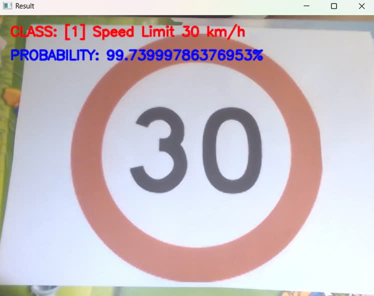
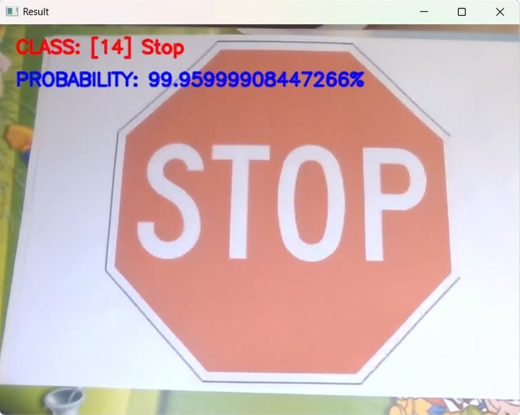
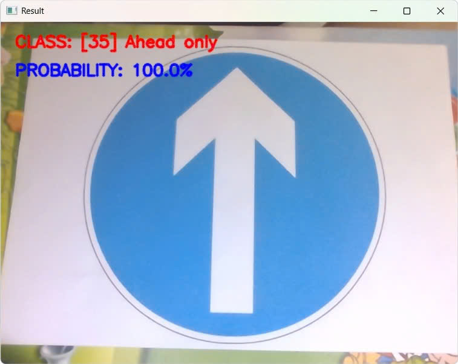
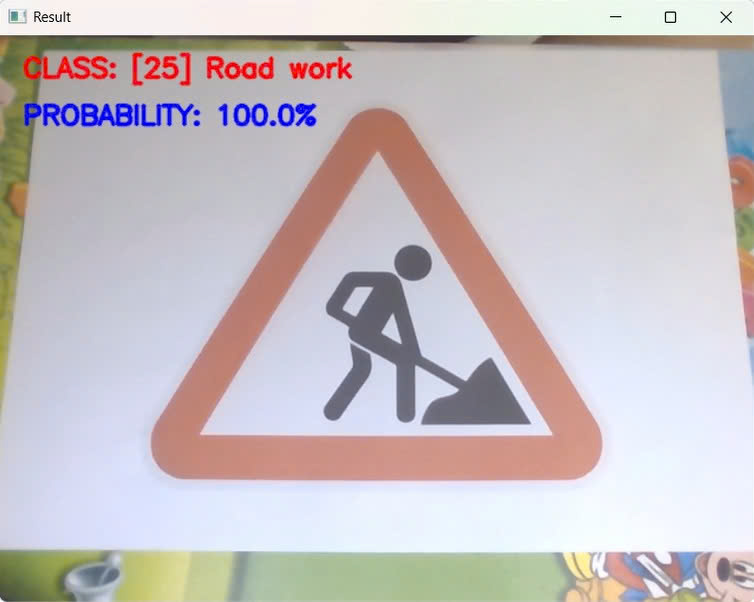

# 🚦 Real-Time Traffic Signs Classification using CNN & OpenCV

This project implements a real-time traffic sign classification system using a Convolutional Neural Network (CNN) built with TensorFlow/Keras, and OpenCV for video capture and visualization. The model is trained on image data of traffic signs and deployed for real-time camera-based inference.

---

## 📌 Features

- ✅ Real-time traffic sign recognition from webcam video.
- ✅ Custom-trained CNN with 30 epochs for improved accuracy.
- ✅ Image preprocessing (grayscale + histogram equalization).
- ✅ Live predictions with confidence score overlay.
- ✅ Lightweight and fast — no object detection dependency.

---

## 🧠 Model Overview

- **Input shape**: 32x32x1 (grayscale)
- **Architecture**:
  - 4 Convolutional layers (with ReLU)
  - MaxPooling layers
  - Dropout layers to prevent overfitting
  - Dense layer (500 nodes)
  - Output layer with softmax for multi-class classification
- **Loss**: Categorical Crossentropy
- **Optimizer**: Adam
- **Epochs**: 30
- **Batch size**: 50

---

## 🧑‍💻 Development & Execution Environment

- 📌 **Training** was done on **Google Colab** using the notebook `Training_code_epoch30.ipynb`.
- 📦 After training, the model was saved as `model_trained_epoch30.p` using `pickle` and downloaded to the local machine.
- 🖥️ **Testing / inference** was performed locally using **PyCharm**, with the script `Test Code.py` running in real time via webcam.

---

## 📂 Project Structure

```
├── myData/                      # Training images organized in subfolders by class
├── labels.csv                   # CSV mapping class numbers to class names
├── Training_code_epoch30.ipynb  # Jupyter Notebook for training (Google Colab)
├── model_trained_epoch30.p      # Trained model (saved with pickle)
├── Test Code.py                 # Python script for real-time camera inference (run on laptop)
├── demo_ts.mp4                  # Demo video showing classification in action
└── README.md
```

---

## 🏋️‍♂️ Training the Model

Run the Jupyter notebook:

```bash
Training_code_epoch30.ipynb
```

Main steps:

1. Load and preprocess all images from `myData/`.
2. Normalize and equalize histogram.
3. One-hot encode the labels.
4. Augment data with `ImageDataGenerator`.
5. Train the CNN for 30 epochs on Google Colab.
6. Save the trained model with `pickle` as `model_trained_epoch30.p`.
7. Download the `.p` file to your laptop for testing.

---

## 🎥 Real-Time Inference

Run the test script on your laptop using PyCharm:

```bash
python "Test Code.py"
```

What it does:

- Opens webcam feed.
- Captures frame-by-frame.
- Resizes and preprocesses each frame.
- Predicts the traffic sign class.
- Overlays:
  - 🚫 `CLASS`: predicted class name
  - 📊 `PROBABILITY`: confidence percentage
- Press `Q` to quit.

---


---

## 📈 Model Performance

After training for 30 epochs on the traffic sign dataset:

- ✅ **Training Accuracy**: ~98.5%
- 🧪 **Validation Accuracy**: ~96.8%
- 🧾 **Test Accuracy**: ~96.2%

These results show the model is well-generalized and performs reliably on unseen data.


## 📊 Demo Results

  
  
  
  
*Model running in real-time with sign classification overlay.*

You can also watch the full demo in [`demo_ts.mp4`](./demo_ts.mp4).

---

## 🔧 Requirements

- Python 3.x
- TensorFlow / Keras
- OpenCV (`cv2`)
- NumPy, Pandas, Matplotlib
- Pickle

Install dependencies:

```bash
pip install tensorflow opencv-python numpy pandas matplotlib
```

---

## 📌 Notes

- This is a **classification-only model** (not detection). For object detection, you can integrate with YOLO or SSD.
- The model performs best under good lighting and with the camera pointed directly at signs.

